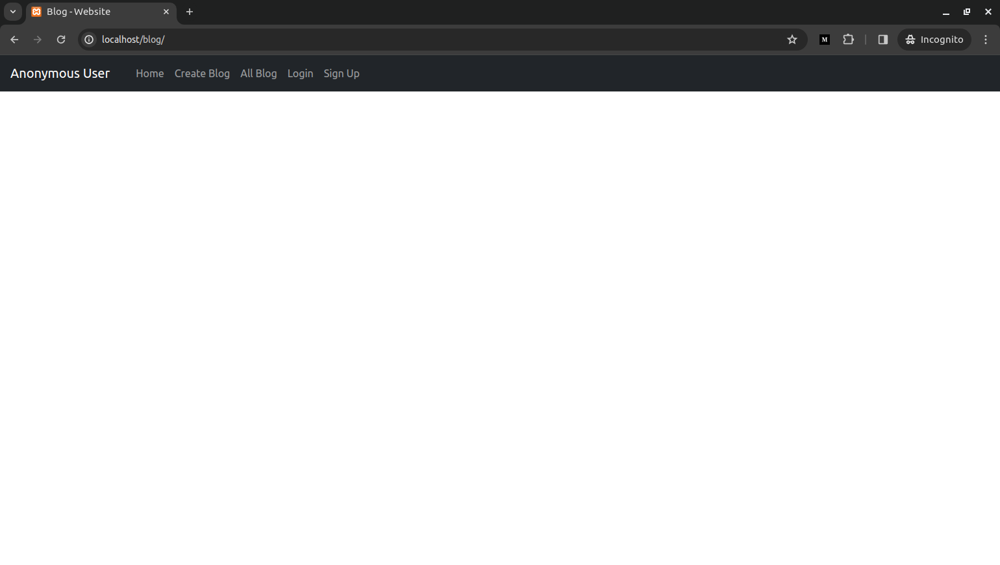
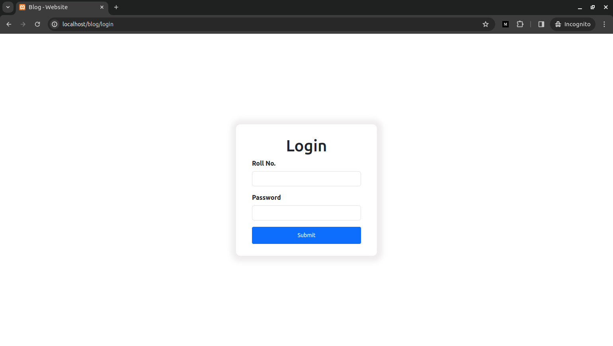
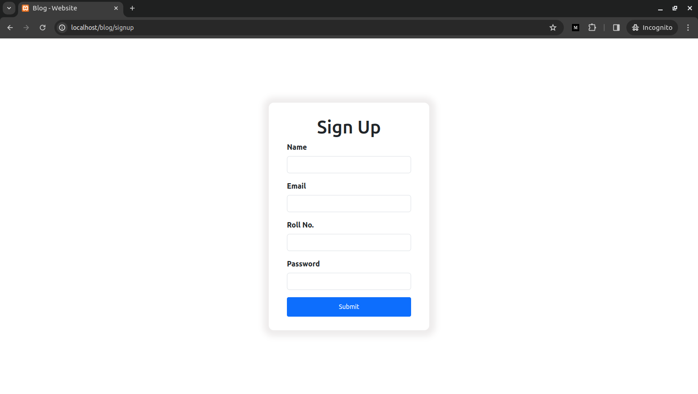
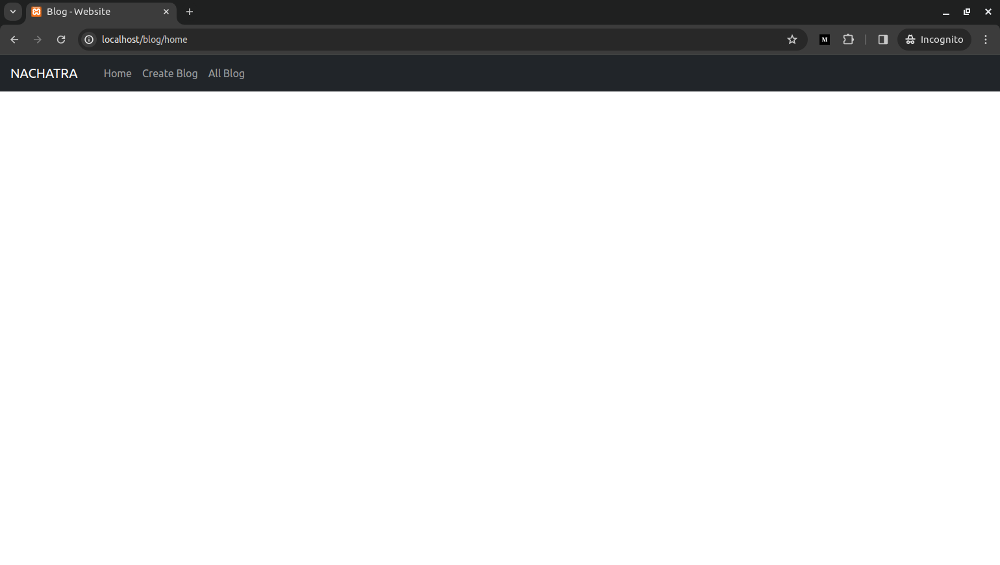
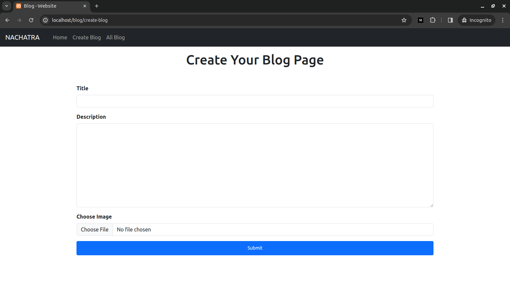
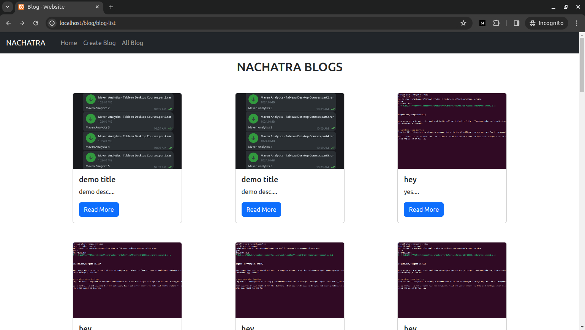
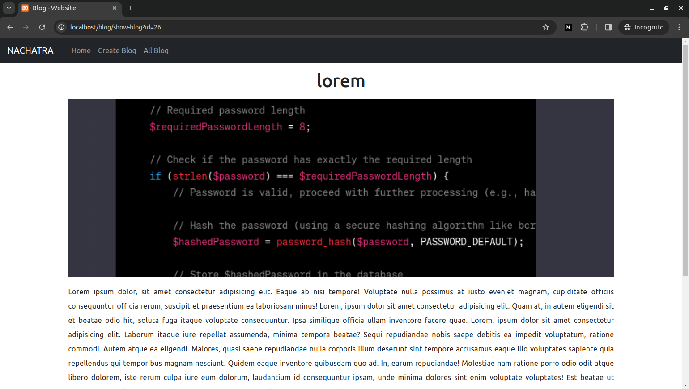

# PHP Developer Machine Round

Check out google doc i had mention all the routes which i am using in my project.

[Google Doc Link](https://docs.google.com/document/d/1Rs52MGtYdXq5BZ3iFC5pzV92mTKm48di-ICotK04T7c/edit)

## Task 1:

```
1. Create a table (students)
2. insert data of students like (Name, Email, and Roll Number)
3. generate password of 8 digit and save in database.
4. (Use dummy design for frontend)
```

## Task 2:

```
1. Design and develop the “Login of student with Roll Number and Password”.
```

## Task 3:

```
Create a table (blogs)
insert data of blog like (Title, Description, Image)
save in the database.
(Use dummy design of frontend)
```

## Task 4:

```
Display the “Blog List that stored in database”
```

## Some Corner Cases:

```
Note:

1. Blog post option will show after login of any student.

2. Blog Display option will show after login of any student

3. Only your own posted blog list will be displayed. (Logged-In student posted blogs)

```

# Web Site Overview

1. When someone comes to our url they will see this home page.



2. If someone try to access other routes like all blogs, show blog, create blog they will redirect to login page.



3. If student want to make a new account they can go to signup page.



4. For successful login or signup it will redirect student to home page.



5. If a student want to create a new blog they can go to create-blog route and create a new blog.



after creating a new blog they will redirect to newly created blog so they can see.

**_If a user try to access show blog they will redirect to blog list so that they can mention which blog they want to access_**

6. show all blog have all the blogs that are created by the user after clicking on read more they all redirect to show-blog route



7. This is how they can access to their created blogs



## Thanks for your time.
